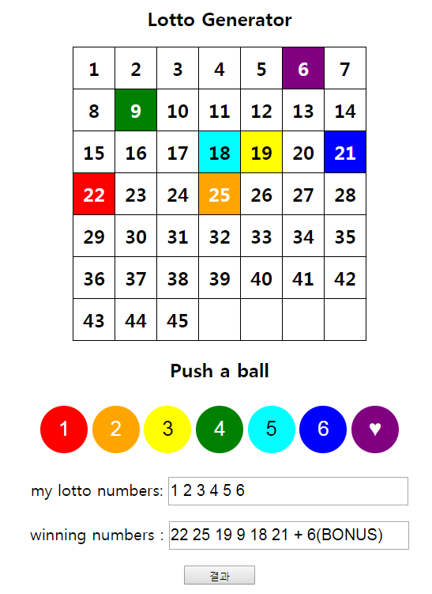

# Lotto Generator

Generate 6 random numbers.

## Screenshot

- [See the result](https://y0ungchoi.github.io/js-example-LottoGenerator/lotto.html)
- <a href="https://y0ungchoi.github.io/js-example-LottoGenerator/lotto.html" target="_blank">example</a>

  

## How to...
1. Insert a number one by one
2. Click each ball
3. Check a results!  

## Built With
- HTML 5
- CSS 3
- JS

## Contributing

Please read [CONTRIBUTING](https://gist.github.com/y0ungchoi/be9662f632063012c84f394ab0ff423b) for details on our code of conduct, and the process for submitting pull requests to us.

## License

This project is licensed under the MIT License - see the [LICENSE](https://gist.github.com/y0ungchoi/22bbc7aa64f6c8ee33850ad88bafdfcf)file for details
